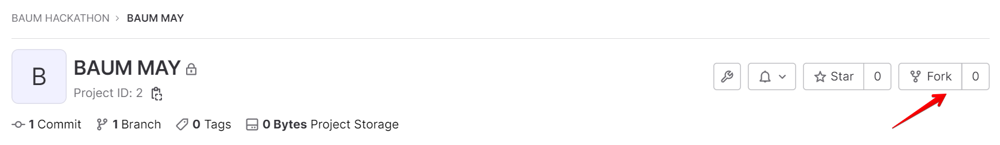
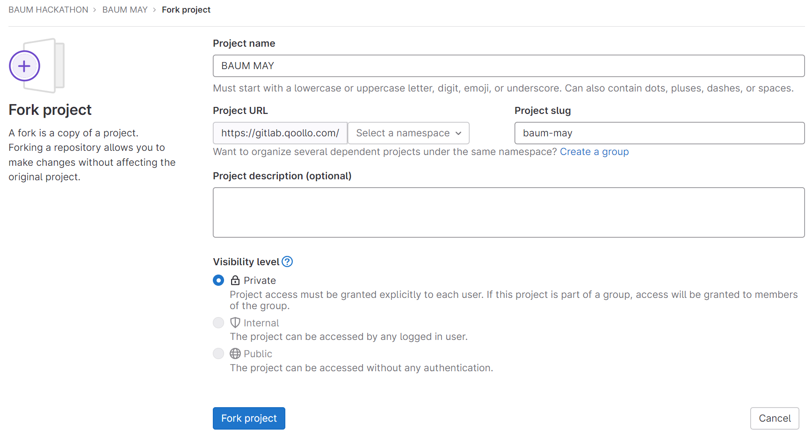
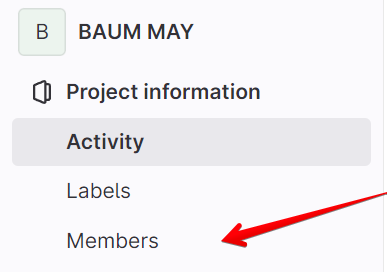

# BAUM MAY

## Выбранная тема: ...

## Порядок работы
1. Выберите задание, которое вы будете выполнять
    - Задания по направлению Web можно найти в файле [tasks-web.md](tasks-web.md)  
    - Задания по направлению C++ можно найти в файле [tasks-cpp.md](tasks-cpp.md)
2. Один из участников команды должен создать fork проекта. Для этого намите на кнопку `Fork` в правой части экрана:
  
Заполните все поля и нажмите `Fork project`:
  
3. Добавьте остальных участников команды в созданный проект. Для этого нажмите `Project information`->`Members`  
  
А затем добавьте участников `Invite members`
  
4. Напишите выбранную тему в README.md в поле *'Выбранная тема:'* в начале файла
5. Сохраняйте все изменения в Gitlab.  
После завершения хакатона наши эксперты посмотрят ваш код, чтобы отобрать на стажировку лучших!

## Работу над кейсами можно продолжить удаленно в вечернее/ночное время. 
## Главное! Не забывайте сохранять все изменения

## Рекомендуемая структура презентации для выступления команд:

1. Направление, название проекта и состав команды
2. Формулировка решаемой проблемы
3. Анализ существующих решений на рынке (с выделением критериев)
4. Формальная постановка задачи
5. Анализ существующих алгоритмов, подходов и методов решения (с выделением критериев)
6. Предлагаемое решение (метод, алгоритм или технологии)
7. Архитектура ПО и технологический стек
8. Предложенные оптимизации и ноу-хау
9. Исследования